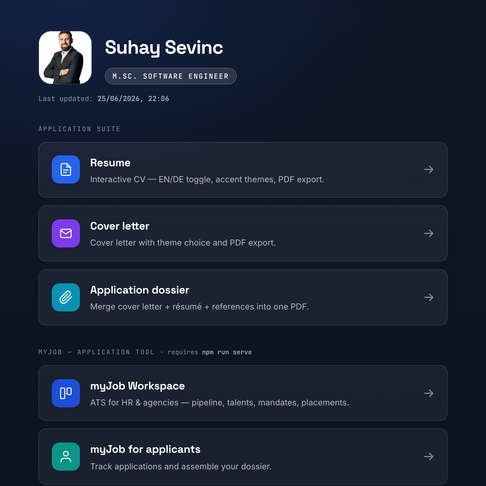
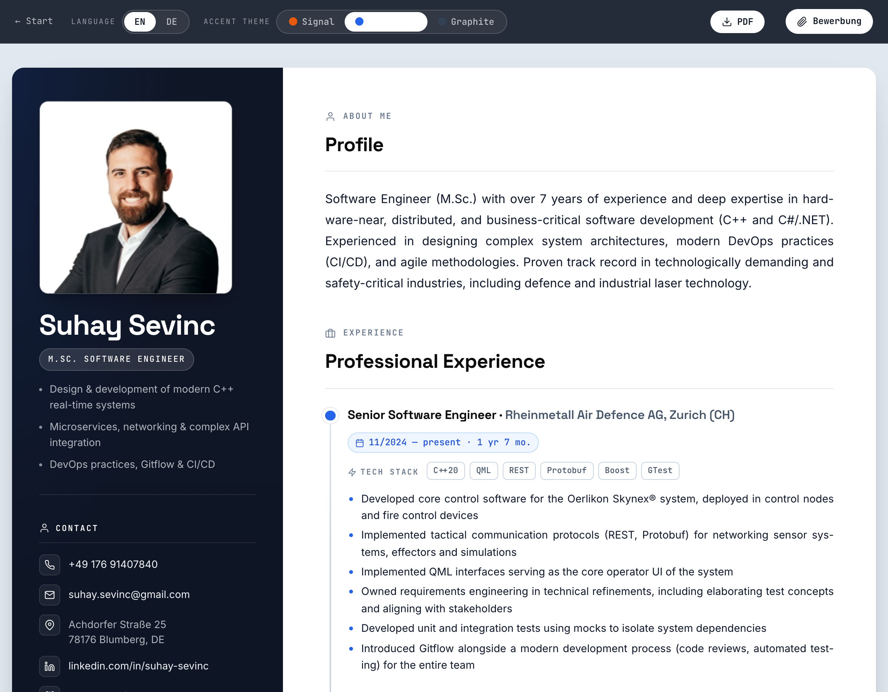

# Bewerbungs-Suite

A self-contained job-application toolkit for **Suhay Sevinc** — an interactive CV and
cover letter, a Bewerbungsmappe (application bundle) builder, a small REST API that
renders/merges and version-controls sent applications, and the **myJob** recruiting
design system (an ATS for HR & Vermittler, plus an applicant app).

Everything is plain HTML/CSS/React over a shared design-token layer. No framework build
step for the pages themselves; Node is used only for PDF generation and the local server.

## Screenshots

**Launcher & interactive CV**

<p>
  
  
</p>

**myJob — recruiting workspace**


## Quick start

```bash
npm install            # one-time (Puppeteer + its Chromium, pdf-lib)
npm run pdf            # render the CV/cover-letter PDFs + refresh builder & home
npm run serve          # serve the whole suite at http://localhost:4178
```

Open **`index.html`** (the launcher) by double-click, or browse to
`http://localhost:4178/` when the server is running.

## What's inside

```
index.html                 ← launcher / home (generated)
ui_kits/
  cv/                      ← interactive CV (EN/DE, accent themes, PDF export)
  cover-letter/            ← Anschreiben (theme switch, PDF export)
  bewerbung/               ← Bewerbungsmappe builder (merge cover letter + CV + Zeugnisse)
tokens/  styles.css  _ds_bundle.js  vendor/   ← CV design system + local React/pdf-lib
components/                ← CV design-system component sources
assets/                    ← portrait (full + downscaled)
bewerbungen/               ← sent-application log + history + archived PDFs
tools/                     ← build + server scripts
myjob/                     ← myJob recruiting design system (see below)
generate-pdf.js            ← npm run pdf entry point
```

## npm scripts

| Script                                        | What it does                                                                                                                                                                                       |
| --------------------------------------------- | -------------------------------------------------------------------------------------------------------------------------------------------------------------------------------------------------- |
| `npm run pdf`                                 | Renders `Lebenslauf-DE.pdf`, `Lebenslauf-EN.pdf`, `Anschreiben.pdf` (Puppeteer, A4, vector text), then rebuilds the Bewerbungsmappe builder (with CV + cover letter pre-loaded) and the home page. |
| `npm run serve`                               | Local REST API + static server on `http://localhost:4178`. Serves all apps over http (so Safari/`file://` limits don't apply) and exposes the applications API.                                    |
| `npm run sent -- "Firma" "Stelle" [pfad.pdf]` | Records a sent application: archives the PDF into `bewerbungen/`, appends to `log.json` + `history.jsonl`, commits to git, and refreshes the home list.                                            |
| `npm run home`                                | Regenerates `index.html` only.                                                                                                                                                                     |

## REST API (`npm run serve`)

The server is the external interface for automating application data; every change is
appended to `bewerbungen/history.jsonl` and committed to git.

- `GET  /api/applications` — list recorded applications
- `GET  /api/history` — the audit trail
- `POST /api/applications` — record an application (`{ firma, stelle, adresse, status, pdfBase64? }`)
- `POST /api/build` — render the cover letter **with the entered recipient address**, merge
  CV + attachments, archive + log + commit, and return the combined PDF
- `PATCH /api/applications/:id` — update status (e.g. → "Gespräch")

## myJob — Bewerbungstool (`myjob/`)

A recruiting design system imported from a Claude Design project, built on the same token
DNA. Two runnable apps:

- **`myjob/ui_kits/recruiting/index.html`** — myJob Workspace, an ATS with two role
  workflows you switch in the nav: **HR** (Pipeline · Stellen · Talente · Berichte ·
  Postfach) and **Vermittler** (Mandate · Talent-Pool · Platzierungen · Berichte ·
  Postfach), sharing a slide-in candidate detail with stage actions.
- **`myjob/ui_kits/bewerber/index.html`** — myJob für Bewerber:innen: an applications
  tracker and Bewerbungsmappe composer.

These load React/Babel from a CDN and compile JSX at runtime, so **open them through the
server** (`npm run serve` → linked from the launcher), not via `file://`.

## Notes

- Generated PDFs at the repo root are git-ignored (regenerate with `npm run pdf`);
  archived application PDFs under `bewerbungen/` are kept.
- Accent themes (`data-theme="blueprint|signal|graphite"`) swap per subtree; the recruiting
  funnel keeps a fixed status palette in every accent.
