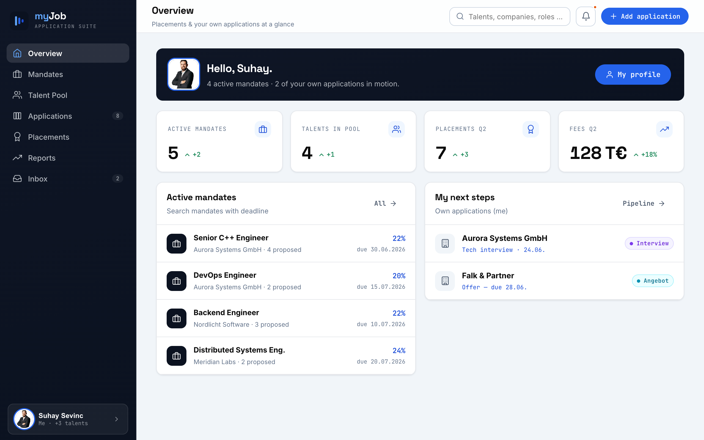
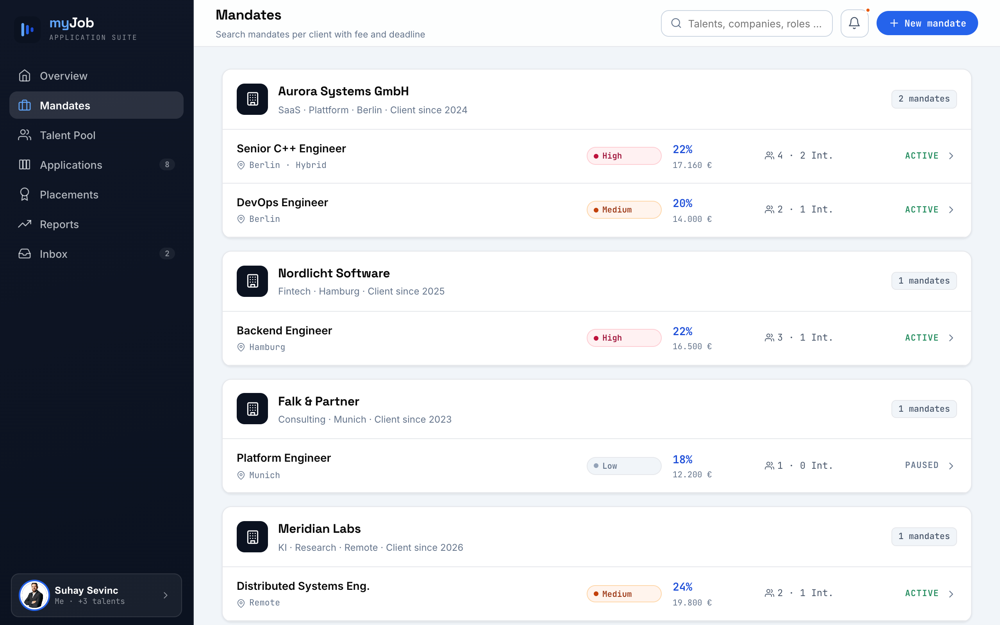
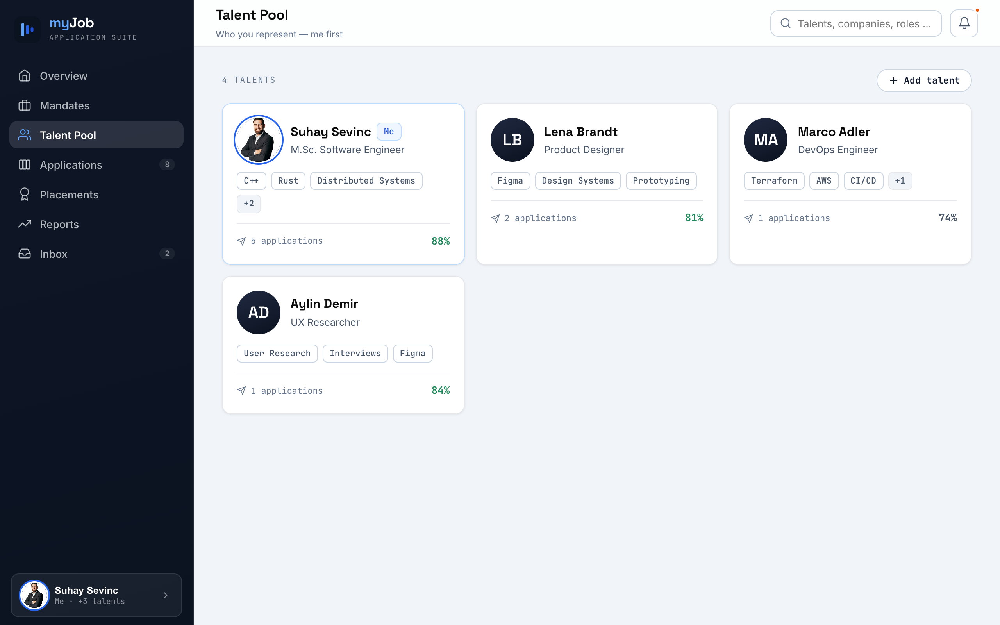
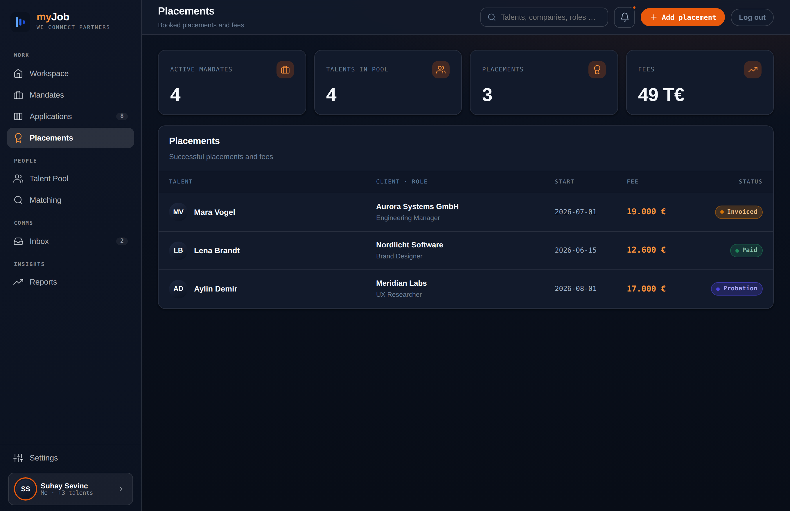
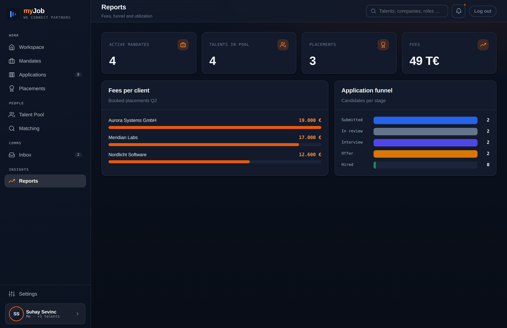
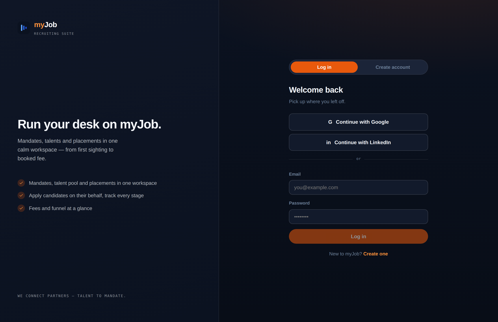

<div align="center">

# myJob — Recruiting Suite

**Run your desk on myJob.** Mandates, talent pool and placements in one calm
workspace — from first sighting to booked fee. Plus an interactive CV, a cover-letter
and Bewerbungsmappe builder, and a small REST API behind it all.

[](https://github.com/NexusHero/Resume/actions/workflows/ci.yml)


</div>

---



## What is this?

A recruiting product (**myJob**) plus the personal job-application toolkit it grew out of:

- **myJob Workspace** — an ATS for recruiters/agencies: **mandates** per client (fee &
  deadline), a **talent pool**, a candidacy **pipeline**, **placements**, a dashboard and
  reports. Multi-user, authenticated, **team-scoped**, with GDPR export/erasure/retention
  built in.
- **CoRecruiter** — the AI agent that works the desk beside you, with one autonomy scale:
  **Suggest** (stages everything for review) → **Act** (applies internal reversible actions
  itself) → **Autopilot** (builds complete applications — CV tailored to the ad, cover
  letter in the ad's language, Bewerbungsmappe with certificates — for strong matches, ready
  for one-click approval). It runs on the server on a schedule (also while you are signed
  out), never sends anything out on its own, and never overwrites a candidate's real CV.
- **AI assistance** — skill **matching** (local embeddings, hybrid) against a mandate, an
  explainable "why this candidate", **interview kits**, **candidate prep**, client
  **pitch** + **outreach**, ATS gap analysis and an AGG check — every LLM feature has a
  deterministic fallback, a **grounding self-check**, and per-call **cost/token** display.
- **First-party moats** — an **outcome loop** (which drafts actually get replies, template
  vs AI), a **learned revenue forecast** (stage probabilities from your own resolved
  pipeline), **email integration** (send outreach + IMAP reply detection that closes the
  loop), and **compliance automation** (KI-Audit-Trail, Löschfristen-Automatik, AGG rewrite).
- **Documents** — an interactive **CV** (EN/DE, accent themes, PDF export), a **cover
  letter**, and a **Bewerbungsmappe** builder.
- **REST API** — a TypeScript, hexagonal Node/Express backend (Zod, problem+json),
  file-backed by default or Postgres via `STORE=sql`.

New here on the architecture? Start with [docs/architecture.md](docs/architecture.md),
the [requirements](docs/requirements.md), [use cases](docs/use-cases.md) and the
[decision log](docs/adr).

<table>
  <tr>
    <td width="50%"></td>
    <td width="50%"></td>
  </tr>
  <tr>
    <td width="50%"></td>
    <td width="50%"></td>
  </tr>
</table>

<div align="center"></div>

## Quick start

```bash
npm install            # dependencies (server, build tools, Playwright)
npm run build:web      # bundle the recruiting app (Vite)
npm run serve          # serve the whole suite at http://localhost:4178
```

Then open **`http://localhost:4178/`** — it opens straight into the **myJob Workspace**.
Create an account on the login screen — the recruiting endpoints are owner-scoped, so your
data is yours.

### With Docker (app + Postgres)

```bash
docker compose up --build      # app on Postgres at http://localhost:4178
```

See **[docs/deployment.md](docs/deployment.md)** for configuration (`STORE`, `DATABASE_URL`,
`CORS_ORIGINS`, `COOKIE_SECURE`, `SESSION_TTL_DAYS`, LLM keys, …).

## Feature highlights

- **CoRecruiter agent** — one agent, three gears (Suggest → Act → **Autopilot**). It
  shortlists pool candidates for active mandates, flags stalled pipeline cards and empty
  profiles, and on Autopilot builds the whole application for a strong match — tailored CV +
  cover letter in the ad's language + Bewerbungsmappe with certificates — and stages it for
  one-click approval, with a "Download Mappe" preview and a grounding warning. A single
  **source** switch aims it at the job postings received from the boards or at your own
  mandates. Runs server-side on a schedule; sending stays your click ([ADR-0019](docs/adr/0019-autopilot-auto-apply-agent.md)).
- **Recruiting core** — create/edit mandates, talents, candidacies and placements through
  real forms; a candidacy **pipeline** (reaching `placed` books a placement), dashboard
  KPIs, a revenue **forecast** and fee-per-client reports computed from your live data.
- **Matching v2 (hybrid, offline)** — rank the pool against a mandate by skill fit (skills
  canonicalised to a taxonomy) blended with **local embedding** similarity between the ad
  and each profile, so fit in the bullets counts too — deterministic, no network, DSGVO-safe.
- **AI prep & explanations** — explain _why_ a candidate fits, generate **interview kits**
  and a **candidate prep kit** (gaps, employer Auflagen, STAR prompts) tailored from the job
  ad + a company archetype and real interview observations captured on the desk.
- **AI pitch & outreach, grounded** — draft a client pitch and first-contact outreach
  (candidate/client, email/LinkedIn); a **grounding self-check** flags any claim the CV +
  mandate don't support, and every result shows its **cost/tokens** right where it appears.
- **The outcome loop** — every generated outreach/pitch is logged (kind, provider, channel —
  never the text) and stamped with its fate; Reports shows honest reply rates by kind and by
  provider (template vs AI), so you learn which drafts actually work for _this_ desk.
- **Email integration** — send drafted outreach straight from the app (SMTP), and an IMAP
  reply-watcher stamps pending outreach as replied automatically — closing the outcome loop.
- **Learned revenue forecast** — the pipeline forecast learns stage win-probabilities from
  your own resolved candidacies (falling back to industry defaults until there's enough
  data, and always declaring which), plus per-client interview→placement intelligence.
- **Auth, teams & RBAC** — email/password accounts, opaque httpOnly sessions with
  server-side expiry + `Secure` cookies, **team-scoped** recruiting data and admin role
  management. Per-user, encrypted LLM keys with per-feature **usage metering**.
- **GDPR/DSGVO & compliance automation** — one-click **data export** (JSON) and **account
  erasure**; a retention report + **Löschfristen-Automatik** (a deletion deadline with an
  opt-in background anonymise sweep); a **KI-Audit-Trail** CSV of every AI call; and an
  **AGG writing aid** that rewrites a flagged job ad into a neutral draft. First-party data
  only — no scraping. See the [EU AI Act brief](docs/eu-ai-act.md) for how these map to the
  Act's transparency and human-oversight obligations for recruiting AI.
- **AI cover letters** — `POST /api/v1/cover-letter` writes a tailored Anschreiben via
  Claude or Gemini, per-user switchable and persisted; deterministic template fallback.
- **Job search & ATS** — skill-matched two-tier search across job boards (honest offline
  sample when live sources are down), a JobScan-style gap analysis and an AGG check.
- **Hardened & honest** — CORS allow-list, baseline security headers, rate-limited
  credentials, and **no fabricated data**: views show real records, a loading or an error
  state — never silent sample data.

## Develop with AI 🤖

This repo is built **with** AI and set up to keep going that way — contributions via
[**Claude Code**](https://claude.com/claude-code) are very welcome.

The codebase is intentionally AI-friendly: small hexagonal modules, behaviour-named tests
(`Subject_StateUnderTest_ExpectedBehaviour`), strict types, and CI gates that give an agent
fast, honest feedback. Drive it with the built-in **skills / slash-commands**:

| Skill              | Use it to…                                     |
| ------------------ | ---------------------------------------------- |
| `/analyze`         | static analysis + type-check before you commit |
| `/test`            | run the full Jest + Playwright suite           |
| `/review`          | review a PR (or your working diff) for bugs    |
| `/security-review` | security pass over the pending changes         |
| `/push`            | commit & push the current change               |

A good first loop: describe the change, let the agent implement it, then run `/analyze`
and `/test` until green and `/review` for a second pair of eyes. Every PR runs the same
gates in CI (verify · e2e · integration · CodeQL · security), so green locally means green
on GitHub.

> New here? Open an issue describing what you want to build and tag it `good-first-task` —
> the structure above makes it a clean target for an AI pair-programmer.

## Tech stack

| Layer       | Choice                                                               |
| ----------- | -------------------------------------------------------------------- |
| Backend     | Node ≥ 24, TypeScript (strict), Express, Zod, awilix DI (hexagonal)  |
| Persistence | File-backed JSON (default) or Postgres via Drizzle (`STORE=sql`)     |
| Frontend    | React, bundled with **Vite** (recruiting kit), shared design tokens  |
| Tests       | Jest + supertest (unit/acceptance), Playwright (e2e), Postgres in CI |
| Tooling     | ESLint, Prettier, Docker, GitHub Actions                             |

## Project layout

```
server/                    ← REST API + static server (TypeScript, hexagonal)
                              (root `/` opens straight into the Workspace)
design/
  documents/ui_kits/       ← CV · cover-letter print templates (behind PDF export)
  myjob/ui_kits/
    recruiting/            ← myJob Workspace (Vite-built → dist/)
vite.config.ts             ← bundles the recruiting kit (no CDN, no runtime Babel)
docs/                      ← architecture · requirements · use-cases · adr/ · roadmap
.github/workflows/ci.yml   ← verify · e2e · integration (Postgres) · commitlint
```

## REST API (selected)

Base path `/api/v1`. Recruiting endpoints require a session; job search and cover-letter
generation are open.

**Full, browsable reference:** the complete OpenAPI 3.1 contract lives in
[`server/openapi.yaml`](server/openapi.yaml) and is served at `/api/v1/openapi.yaml`;
a self-hosted **Swagger UI** (no CDN — [ADR-0012](docs/adr/0012-self-hosted-swagger-ui.md))
runs at [`/api/v1/docs`](http://localhost:4178/api/v1/docs).

| Endpoint                                                          | What it does                                               |
| ----------------------------------------------------------------- | ---------------------------------------------------------- |
| `POST /auth/register` · `/auth/login`                             | create / sign in to an account                             |
| `GET·POST·PATCH·DELETE /mandates`                                 | client search mandates (team-scoped)                       |
| `GET·POST·PATCH·DELETE /talents`                                  | the talent pool                                            |
| `POST /mandates/:id/match`                                        | rank the pool against the mandate by skill fit             |
| `… /mandates/:id/candidacies` · `PATCH /candidacies`              | the candidacy pipeline (→ placement on `placed`)           |
| `GET·POST·PATCH·DELETE /placements` · `GET /forecast`             | booked placements + fees · revenue forecast                |
| `POST /talents/:id/documents/pitch` · `…/outreach`                | AI client pitch · outreach (grounded)                      |
| `POST /mandates/:id/candidates/:tid/prep`                         | candidate prep kit (gaps · Auflagen · STAR)                |
| `… /mandates/:id/observations`                                    | capture interview observations (the flywheel)              |
| `GET·PUT /assistant` · `POST /assistant/run`                      | CoRecruiter settings (gear, source) · run the playbook now |
| `GET /assistant/suggestions` · `…/:id/accept`·`/dossier.pdf`      | the review queue · approve · download a staged Mappe       |
| `GET /artifacts` · `/artifacts/stats` · `…/:id/outcome`           | the outcome loop — artifacts, reply rates, stamp a fate    |
| `POST /talents/:id/outreach/send` · `POST /mail/sync-replies`     | send outreach by email · IMAP reply detection              |
| `GET /account/export` · `DELETE /account`                         | GDPR data export / account erasure                         |
| `GET·PUT /retention/policy` · `POST /retention/anonymize-overdue` | Löschfristen policy · bulk anonymise overdue               |
| `GET /settings/usage/audit.csv` · `POST /compliance/agg-rewrite`  | KI-Audit-Trail export · AGG neutral rewrite                |
| `GET /members` · `PATCH /members/:id/roles`                       | team members · RBAC role management (admin)                |
| `GET /jobs` · `POST /ats` · `POST /compliance/agg-check`          | job search · ATS gap · AGG compliance check                |
| `POST /cover-letter` · `PUT /settings/llm` · `…/keys`             | AI Anschreiben · switch Claude/Gemini · per-user keys      |

## npm scripts

| Script                                  | What it does                                                   |
| --------------------------------------- | -------------------------------------------------------------- |
| `npm run serve`                         | REST API + static server on `http://localhost:4178`            |
| `npm run build:web`                     | bundle the recruiting kit with Vite (→ `…/recruiting/dist`)    |
| `npm test`                              | Jest unit + acceptance with coverage gate                      |
| `npm run test:e2e`                      | Playwright UI acceptance (boots the server, builds the bundle) |
| `npm run pdf`                           | render the CV / cover-letter PDFs from the print templates     |
| `npm run lint` · `npm run format:check` | ESLint · Prettier                                              |

## License

See [LICENSE](LICENSE). The CV content and portrait are personal to Suhay Sevinc; the code
and design system are free to learn from and build on.
