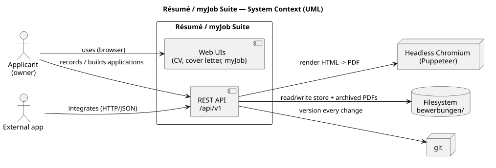
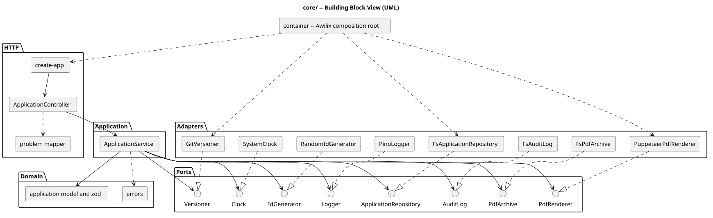
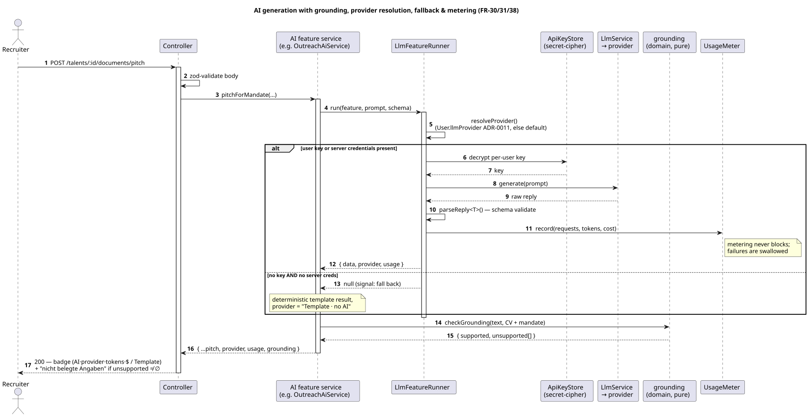
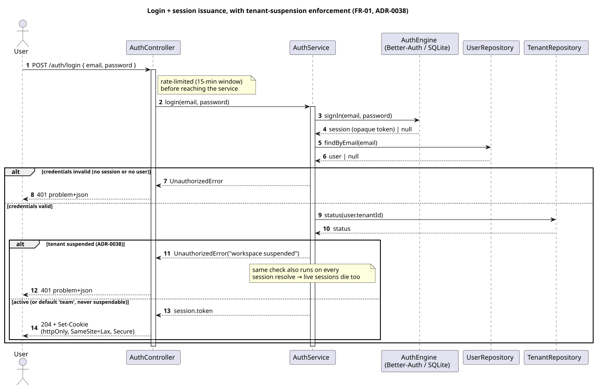
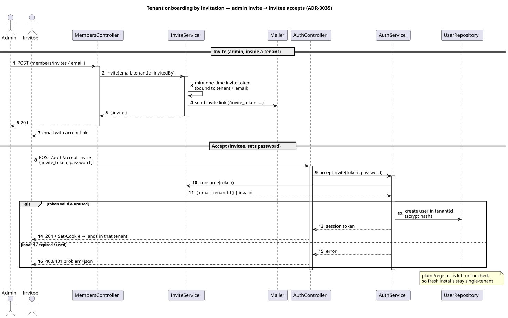
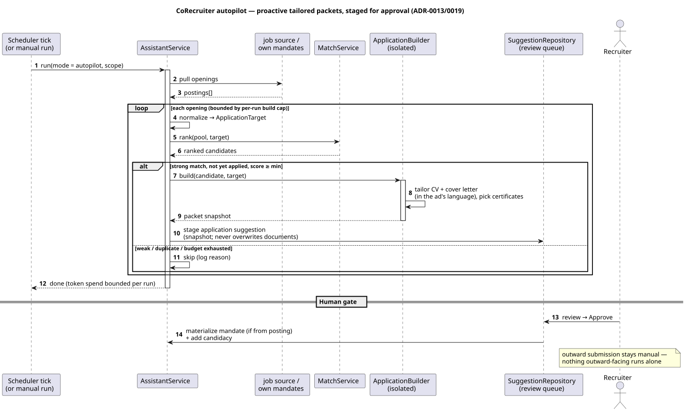
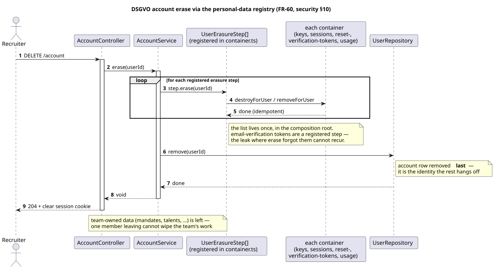

# Architecture — myJob Recruiting Suite

> Documented with [arc42](https://arc42.org). Modeling language: **UML** (PlantUML sources in
> [`docs/umls/`](umls), rendered to `.svg`). Companion docs:
> [requirements](requirements.md) · [use cases](use-cases.md) ·
> [architecture decisions](adr) · [security concept](security.md) · [roadmap](roadmap.md) ·
> [EU AI Act brief](eu-ai-act.md) · [deployment blueprint](deployment-blueprint.md).

## 1. Introduction and Goals

**myJob** is a recruiting suite for agencies/recruiters, grown out of a personal
job-application toolkit:

- **myJob Workspace** — an ATS: client **mandates** (fee, deadline, job ad), a **talent
  pool**, a candidacy **pipeline**, **placements**, dashboards and reports. Multi-user,
  authenticated, team-scoped, with DSGVO/GDPR export/erasure/retention built in.
- **AI assistance** — the differentiator: skill matching, explainable match, interview
  kits, candidate prep, client pitch + outreach, ATS gap analysis, AGG compliance — all
  with deterministic fallbacks and a grounding self-check over generated text.
- **CoRecruiter** — an in-process agent (ADR-0013) that prepares the desk proactively
  (shortlists, stalled-pipeline nudges, data-gap flags) and, in its top `autopilot` gear
  (ADR-0019), builds complete tailored application packets for strong matches and stages
  them for one-click approval — sourced from received job postings or own mandates.
- **Evidence layer** — an outcome loop (ADR-0014), learned stage-probability forecast
  (ADR-0016) and a KI-Audit-Trail with retention automation (ADR-0018) make the AI
  auditable: what it did, what it cost, and whether it worked.
- **Documents** — an interactive CV, a cover letter, and a Bewerbungsmappe/dossier
  builder with vector-quality PDF export.
- **REST API** — a TypeScript, hexagonal Node/Express backend under `/api/v1`.

### Quality goals

| #   | Quality         | Scenario                                                                             |
| --- | --------------- | ------------------------------------------------------------------------------------ |
| 1   | Maintainability | Hexagonal, SOLID, ≥ 90 % test coverage on core logic (NFR-01).                       |
| 2   | Trust           | No fabricated data; AI claims are grounded, or fall back deterministically (NFR-05). |
| 3   | Privacy         | First-party data only; DSGVO export/erasure/retention (NFR-07).                      |
| 4   | Correctness     | zod at the boundary, problem+json errors, SQL round-trips verified (NFR-02/04).      |

### Stakeholders

| Role                     | Concern                                                     |
| ------------------------ | ----------------------------------------------------------- |
| Recruiter / Admin        | Run the desk: mandates, pool, pipeline, placements, AI aid. |
| Candidate (data subject) | Their personal data is handled lawfully and can be erased.  |
| Contributors             | Clear architecture, tests, decisions, contribution rules.   |

## 2. Constraints

- Backend: **TypeScript (strict)**, **Awilix** DI (no decorators), **pino** logging,
  **zod** validation, **RFC-9457** problem+json errors.
- Recruiting kit is a **Vite**-built React app; no runtime Babel/CDN.
- English end-to-end (code, commits, API). Conventional Commits, PR-only to a protected
  `main`.
- AI is optional: the suite must fully function with **no LLM key** (ADR-0005).

## 3. Context and Scope

See [`docs/umls/03_system_context.puml`](umls/03_system_context.puml).

- **Recruiter/Admin** → the Workspace (browser) → REST API over HTTP (`/api/v1`), session
  cookie authenticated. External integrators use the same API — the OpenAPI contract is
  served at `/api/v1/openapi.yaml`, browsable at `/api/v1/docs` (ADR-0012).
- API → **LLM providers** (Claude / Gemini) with the user's own key and persisted
  provider choice (ADR-0011), for AI features — optional.
- API → **job boards** (Arbeitnow / Bundesagentur / Adzuna) for search — resilient composite.
- API → **SMTP mailer** for email verification, password-reset links and sending drafted
  outreach (console in dev); API → **IMAP mailbox** (optional, `MAIL_IMAP_*`) polled for
  replies to close the outcome loop — envelopes only, no message bodies (ADR-0015).
- API → **Puppeteer** (headless Chromium) to render PDFs.
- API → **Postgres** (`STORE=sql`) or the **filesystem** (default) for persistence.

## 4. Solution Strategy

| Goal            | Approach                                                                                   | ADR              |
| --------------- | ------------------------------------------------------------------------------------------ | ---------------- |
| Maintainability | Domain → ports → services → http; adapters wired in one composition root.                  | 0001, 0002       |
| Portability     | Every repository behind a port; file store default, Postgres opt-in.                       | 0003             |
| Trust           | Deterministic LLM fallback + grounding self-check; no scraping, first-party data only.     | 0005, 0006, 0009 |
| Security        | Auth + RBAC + team scope; CORS allow-list, headers, rate-limited creds, encrypted secrets. | 0004, 0010       |
| Agency          | One in-process agent, single autonomy scale (`suggest`→`act`→`autopilot`), staged review.  | 0013, 0019       |
| Matching        | Hashed embeddings + hybrid ranking (offline default); opt-in neural (Ollama/OpenAI).       | 0007, 0017, 0020 |
| Evidence        | Outcome loop + learned forecast + KI-Audit-Trail and retention automation (EU-AI-Act).     | 0014, 0016, 0018 |

## 5. Building Block View

The backend lives in `server/src/` and is strictly layered (dependencies point inward only):

> The diagram shows representative blocks per layer; the table below completes the
> inventory.

| Layer       | Building blocks (selected)                                                                                                                                                                                                                                                                        | Responsibility                                                                       |
| ----------- | ------------------------------------------------------------------------------------------------------------------------------------------------------------------------------------------------------------------------------------------------------------------------------------------------- | ------------------------------------------------------------------------------------ |
| HTTP        | `create-app`, `*-controller` (mandate, talent, candidacy, placement, match, match-ai, document, compliance, forecast, observation, members, …), `problem`, `security`                                                                                                                             | Express routing, zod validation at the boundary, RFC-9457 errors, auth/CORS/headers. |
| Application | `*-service` (mandate, talent, candidacy, placement, match, forecast, retention, members, usage, job-search, …); the AI services (`document-assist`, `cv-parse`, `ats-ai`, `outreach-ai`, `match-ai`) over the shared **`LlmFeatureRunner`** (ADR-0022), with `DocumentAiService` as a thin facade | Business rules only; depend on ports, never adapters.                                |
| Domain      | `mandate`, `talent`, `candidacy`, `placement`, `match`, `skill-semantics`, **`skill-taxonomy`**, **`grounding`**, `candidate-prep`, `company-archetype`, `interview-*`, `agg-check`, `forecast`, `errors`                                                                                         | The model, its invariants, and pure deterministic algorithms. No I/O.                |
| Ports       | `*-repository`, `session-store`, `llm-provider`, `api-key-store`, `usage-meter`, `skill-extractor`, `job-source`, `pdf-*`, `mailer`, `authorizer`, `clock`, …                                                                                                                                     | Interfaces the services depend on.                                                   |
| Adapters    | `fs-*` / `sql/*` repositories, `anthropic`/`gemini` LLM providers, `*-job-source`, `puppeteer-pdf-renderer`, `pdf-lib-merger`, `scrypt-password-hasher`, `secret-cipher`, `pino`, …                                                                                                               | Concrete I/O, wired in `container.ts` (Awilix).                                      |

The composition root (`container.ts`) is the single place that knows which adapter
implements each port — see ADR-0002 for the registration discipline this demands.

## 6. Runtime View

> Each flow is tagged with the requirements and decisions it realises, so the
> chain runs requirement → feature → flow → ADR (see the [traceability matrix](#traceability-matrix)).

**AI generation with grounding** _(FR-30, FR-31, FR-38 · ADR-0005/0009/0011)_ —
`POST /api/v1/talents/:id/documents/pitch` (outreach is analogous):

1. The controller validates the body (zod) and calls `DocumentAiService.pitchForMandate`.
2. The service resolves the provider: the user's **persisted choice** (`User.llmProvider`,
   ADR-0011) or the configured default, then their encrypted key for it; with neither a
   user key nor server credentials it uses the deterministic template.
3. It builds a **grounding source** from the candidate's documents + the mandate context,
   generates the pitch (LLM or template), and runs `checkGrounding` over it.
4. It meters the call (requests/tokens/cost) and returns
   `{ …pitch, provider, usage, grounding }` — `usage` is the per-call token/cost payload.
5. The Editor UI renders the pitch with a provider badge ("AI · gemini · 1.4k tok ·
   $0.0011" / "Template · no AI") and, if `grounding.unsupported` is non-empty, a
   "nicht belegte Angaben" warning for the recruiter to resolve before sending.

**Pipeline → placement** _(FR-12, FR-13, FR-14)_ — advancing a candidacy to `placed` cascades to create a
placement with its fee; mandate submitted/interview counts and the revenue forecast are
derived from the live pipeline, never stored twice.

**CoRecruiter autopilot** _(ADR-0013/0019 · FR-30, FR-32, FR-42)_ — on a scheduler tick (or manual run) in `autopilot` mode,
`AssistantService` pulls openings from the configured source (received job postings or
own mandates), normalizes each to an `ApplicationTarget`, ranks the pool against it and —
for strong, not-yet-applied matches, bounded by a per-run build cap and a minimum score —
calls the isolated `ApplicationBuilder` to tailor a CV + cover letter (in the ad's
language) and select certificates. The packet is stored as a **snapshot** on an
`application` suggestion (never overwriting the candidate's documents) and staged for
approval; approving materializes a mandate from a posting if needed and adds the candidacy.
The outward submission stays a manual step (ADR-0019).

### Sequence diagrams

The multi-actor / multi-branch flows above are drawn as UML sequence diagrams
(PlantUML sources in [`docs/umls/`](umls)); each carries its branches and notes
so the behaviour — not just the call order — is legible.

**AI generation with grounding, fallback & metering** (FR-30/31/38) — provider
resolution, the key-or-fallback branch, schema validation and non-blocking metering:

**Login + session, suspension-enforced** (FR-01, ADR-0038) — the invalid-credentials
and suspended-tenant branches, and why a suspension also kills live sessions:

**Invite → accept onboarding** (ADR-0035) — the two-actor admin-invite / invitee-accept
round-trip that leaves plain `register` untouched:

**CoRecruiter autopilot** (ADR-0013/0019) — the bounded build loop, the skip branches,
and the human approval gate before anything materialises:

**DSGVO account erase via the personal-data registry** (FR-60) — the registry loop,
account-row-last ordering, and why the verification-token leak cannot recur:

### Traceability matrix

The requirement catalogue ([requirements.md](requirements.md)) lists FR → module.
This matrix closes the loop the other way — requirement → **runtime flow /
sequence diagram** → ADR — so a reviewer can walk from a requirement to the
behaviour that realises it, not just the file that holds it. Sequence sources are
in [`docs/umls/`](umls).

| Requirement         | Feature / module                           | Runtime flow (sequence)                                                | ADR                 |
| ------------------- | ------------------------------------------ | ---------------------------------------------------------------------- | ------------------- |
| FR-30, FR-31, FR-38 | AI services + `LlmFeatureRunner`           | [AI generation w/ fallback + metering](umls/06_seq_ai_generation.puml) | 0005, 0009, 0011    |
| FR-01               | `auth-service`, `session-store`            | [Login + session, suspension-checked](umls/06_seq_login.puml)          | 0004, 0038          |
| FR-04 (onboarding)  | `invite-service`, `auth-service`           | [Invite → accept onboarding](umls/06_seq_invite_accept.puml)           | 0035                |
| FR-30, FR-32, FR-42 | `assistant-service`, `application-builder` | [CoRecruiter autopilot](umls/06_seq_autopilot.puml)                    | 0013, 0019          |
| FR-60               | `account-service` + personal-data registry | [DSGVO erase via registry](umls/06_seq_account_erase.puml)             | 0004 · security §10 |
| FR-12, FR-13, FR-14 | `candidacy-service`, `placement-service`   | Pipeline → placement (§6, prose)                                       | 0010                |
| FR-61               | `retention-service`                        | Retention report + anonymise sweep (§6 companion, ADR-0018)            | 0018                |

Rows without a sequence diagram are single-collaborator flows adequately covered
by prose; the five diagrammed flows are the multi-actor / multi-branch ones where
a picture earns its place.

## 7. Deployment View

- **Local:** `npm run serve` runs the TypeScript server (`tsx`); it serves both the REST
  API (`/api/v1`) and the static web UIs. `npm run build:web` bundles the recruiting kit.
- **Docker:** `docker compose up --build` runs the app on Postgres (`STORE=sql`).
- **Release:** a tag push (or manual `workflow_dispatch` with a `tag` input) builds
  per-OS artifacts — compiled server + static app + the OpenAPI contract; run with
  `npm ci --omit=dev && npm start`.
- **Config:** `STORE`, `DATABASE_URL`, `CORS_ORIGINS`, `COOKIE_SECURE`, `SESSION_TTL_DAYS`,
  `JOB_SOURCES`, LLM keys, SMTP — see [deployment.md](deployment.md). No secrets in the repo.

## 8. Cross-cutting Concepts

- **AI safety:** deterministic fallback + per-user keys + metering (ADR-0005); the
  provider choice is per user and persisted (ADR-0011); grounding self-check (ADR-0009);
  first-party data, no scraping (ADR-0006).
- **Cost transparency:** every LLM-backed response carries `usage` (tokens + estimated
  USD) shown at the result; the settings card aggregates per provider and feature; the
  KI-Audit-Trail (ADR-0018) keeps a per-call record for DSGVO/EU-AI-Act transparency.
- **Agency:** one in-process agent, a single autonomy scale (`suggest`→`act`→`autopilot`),
  every finding staged in a team-scoped review queue; nothing outward-facing or
  destructive runs alone, and token spend is bounded per run (ADR-0013, ADR-0019).
- **Skills:** canonicalised (ADR-0008) then matched semantically offline (ADR-0007), with
  local hashed embeddings + hybrid lexical/semantic ranking (ADR-0017).
- **Security:** the posture is documented end-to-end in the [security concept](security.md) —
  trust boundary, authentication (opaque `httpOnly`/`SameSite=Lax` sessions, scrypt
  passwords), authorization (RBAC + the `requireAuth`/`requirePlan` route seams),
  per-tenant isolation, the config-only non-escalatable super-admin, suspension enforced
  in the auth path, AES-256-GCM-encrypted per-user keys, CORS allow-list + CSP + security
  headers, auth rate-limiting, and the honest gaps (no CSRF token under today's
  `SameSite=Lax`, no key-rotation runbook). The controls→ADR→verification table lives there;
  the tenancy detail below expands the isolation model.
- **Auth & tenancy:** sessions + RBAC (ADR-0004); recruiting data is scope-owned (ADR-0010).
  `currentScope(req)` resolves to the user's `tenantId`, defaulting to `'team'` when absent
  (ADR-0033) — the seam is multi-tenant-ready while every current install stays single-tenant.
  Member management (roster + role admin) is tenant-scoped too (ADR-0034): an admin only sees
  and re-roles their own tenant, and the last-admin invariant is enforced per tenant. A user
  acquires a non-default tenant by **invitation** (ADR-0035): an admin invites an email from
  Settings (`POST /members/invites`), the invitee opens the emailed link and accepts by setting a
  password (the login screen's `?invite_token=` mode → `POST /auth/accept-invite`) and lands in
  that tenant — `register` is left untouched, so fresh installs stay single-tenant. With
  `SELF_SERVE_TENANTS` on, each sign-up instead spins up its own workspace (ADR-0036). An
  instance **super-admin** (`SUPER_ADMIN_EMAIL`, config-only, never grantable via the API)
  gets a cross-tenant console — list every workspace, re-role any tenant's members, and suspend
  a tenant to lock its members out immediately (ADR-0037/0038); it surfaces as a Platform card
  in Settings when `/auth/me` reports `isSuperAdmin`.
- **API contract:** hand-maintained OpenAPI 3.1 + self-hosted Swagger UI (ADR-0012),
  extended in the same PR as any route change.
- **Self-hosted assets:** fonts and the Swagger UI ship from this origin — no CDN, no
  third-party request leaves the browser (DSGVO); strict CSP on the built kit and docs.
- **DI discipline:** new ports must be registered in `container.ts`; unit tests won't catch
  a missing registration — the e2e boot will (ADR-0002).
- **Validation & errors:** zod at the boundary; RFC-9457 problem+json.
- **Privacy:** DSGVO export/erasure/retention/anonymisation as first-class flows.
- **Logging:** structured pino, injected.

## 9. Architecture Decisions

Full log in [`docs/adr/`](adr). Summary:

| ADR  | Decision                                                         | Status                          |
| ---- | ---------------------------------------------------------------- | ------------------------------- |
| 0001 | Hexagonal TypeScript backend (ports & adapters, SOLID)           | Accepted                        |
| 0002 | Awilix DI with a single composition root                         | Accepted                        |
| 0003 | File store default, Postgres via `STORE=sql`                     | Accepted                        |
| 0004 | Authenticated, team-scoped, RBAC API                             | Accepted (supersedes open API)  |
| 0005 | Deterministic fallback + per-user keys + metering for all AI     | Accepted                        |
| 0006 | First-party observation flywheel; no scraping of review sites    | Accepted                        |
| 0007 | Offline semantic skill matching (ontology + trigram fuzzy)       | Accepted                        |
| 0008 | Skill canonicalization taxonomy                                  | Accepted                        |
| 0009 | Grounding self-check over generated text                         | Accepted                        |
| 0010 | Team scope as the ownership boundary for recruiting data         | Accepted                        |
| 0011 | Per-user, persisted LLM provider choice                          | Accepted                        |
| 0012 | Hand-maintained OpenAPI contract + self-hosted Swagger UI        | Accepted                        |
| 0013 | In-process assistant agent with staged-suggestion autonomy       | Accepted (extended by 0019)     |
| 0014 | First-party outcome loop (artefact → result tracking)            | Accepted                        |
| 0015 | First-party email integration (send outreach, detect replies)    | Accepted                        |
| 0016 | Learned stage-transition probabilities for the forecast          | Accepted                        |
| 0017 | Local hashed embeddings + hybrid matching                        | Accepted                        |
| 0018 | Compliance automation (audit trail, retention, AGG engine)       | Accepted                        |
| 0019 | Autopilot: the auto-apply gear of the one agent (CoRecruiter)    | Accepted                        |
| 0020 | Pluggable neural embeddings (Ollama, OpenAI) behind the port     | Accepted                        |
| 0021 | Pro/Free plan gating at one HTTP seam (license deferred)         | Accepted                        |
| 0022 | Split DocumentAiService into a runner + five services            | Accepted                        |
| 0023 | Frontend unit/component test base with Vitest (jsdom)            | Accepted                        |
| 0024 | Split the MandatePipeline god-component (board + 5 modals)       | Accepted                        |
| 0025 | Responsive app shell (matchMedia hook + mobile drawer)           | Accepted (E1 slice 1)           |
| 0026 | Responsive dense views (dashboard grids + scrollable tables)     | Accepted (E1 slice 2)           |
| 0027 | Responsive CV profile, editor, and form modals                   | Accepted (E1 slice 3)           |
| 0028 | Installable PWA (manifest + hand-rolled service worker)          | Accepted (E2)                   |
| 0029 | Fail-fast production readiness gate (Postgres, APP_SECRET)       | Accepted (D-series slice 1)     |
| 0030 | Scheduler leader election via Postgres advisory locks            | Accepted (D-series slice 2)     |
| 0031 | PDF archive to S3-compatible object storage                      | Accepted (D-series slice 3)     |
| 0032 | Bounded PDF render pool (concurrency semaphore)                  | Accepted (D-series slice 4)     |
| 0033 | Multi-tenant scope foundation (tenantId, default 'team')         | Accepted (D-series slice 6·1)   |
| 0034 | Tenant-scoped member management (roster + role admin)            | Accepted (D-series slice 6·2)   |
| 0035 | Tenant onboarding by invitation (admin invite → accept)          | Accepted (D-series slice 6·3)   |
| 0036 | Tenant registry + self-serve creation (SELF_SERVE_TENANTS)       | Accepted (D-series slice 6·4·1) |
| 0037 | Super-admin capability + cross-tenant registry read              | Accepted (D-series slice 6·4·2) |
| 0038 | Cross-tenant management + tenant suspension (enforced)           | Accepted (D-series slice 6·4·3) |
| 0039 | Richer offline experience (offline banner + SWR service worker)  | Accepted                        |
| 0040 | Capacitor native app wrapper (web-side wiring; native is manual) | Accepted                        |

## 10. Quality Requirements

See [requirements.md](requirements.md) for the full FR/NFR catalogue. Verification:

| Quality         | Requirement | Verified by                                                                |
| --------------- | ----------- | -------------------------------------------------------------------------- |
| Maintainability | NFR-01      | Jest coverage gate (≥ 90 %) in CI                                          |
| Correctness     | NFR-02      | acceptance (supertest) tests                                               |
| Type safety     | NFR-03      | `npm run typecheck` in CI                                                  |
| Persistence     | NFR-04      | `DATABASE_URL`-gated Postgres integration tests                            |
| Trust / honesty | NFR-05      | Playwright e2e + grounding unit tests                                      |
| Frontend logic  | (ungated)   | Vitest jsdom tests (`test:web`) — run, not a coverage gate (see §11)       |
| Security        | NFR-06      | [security concept](security.md); CodeQL + security workflow; `security.ts` |
| Consistency     | NFR-09      | Conventional-commit + format/lint checks in CI                             |

## 11. Risks and Technical Debt

This chapter separates **paid-down debt** (kept as a short changelog so a reader
knows it was addressed, not overlooked) from **open risk** (what still needs
watching). If you are scanning for current exposure, read §11.2.

### 11.1 Resolved debt (changelog)

- ✅ **Clean-code review done** (roadmap 0.9) — a three-dimension audit (clean code,
  architecture conformance, UX walkthrough) confirmed the layering holds; the found debt
  was paid down: the per-feature LLM scaffold collapsed into one `runLlm()` helper, five
  duplicated `candidateFacts` builders unified, PII/sample data removed from the shipped
  bundle, the remaining German UI chrome translated, dead exports deleted and the
  scope/userId naming drift fixed.
- ✅ **Backend god classes split (ADR-0022):** `DocumentAiService`'s ten AI features became a
  shared `LlmFeatureRunner` plus five single-concern services, with the old class kept as a
  thin logic-free facade so callers are unchanged; the shared LLM idiom now has one home.
  `AssistantService`'s playbook `run()` (was ~120 lines mixing four strategies) was decomposed
  into single-concern private steps (`proposeShortlists`, `proposeStalledFollowUps`,
  `proposeDataGaps`) over a shared `stage()` helper, with the token-spending autopilot step
  already its own service (`AutopilotService`, ADR-0019/PR5). **No backend god class remains.**
- ✅ **Frontend god-component split (ADR-0024):** `MandatePipeline` (was ~720 lines) became a
  board-only orchestrator plus five feature modals that each own their state, locked by 22 new
  Vitest tests.
- ✅ **DSGVO erase/export registered, not hand-listed:** account erase and export now run off a
  personal-data registry in the composition root (`ports/personal-data.ts`) instead of a
  per-store list — closing a real leak where erase never cleared email-verification tokens. A
  new personal-data container is one registration, and the compiler + a regression test guard
  against a forgotten one. See the [security concept §10](security.md).

### 11.2 Open risks and technical debt

- **Largest remaining frontend components:** `Editor` and `SettingsView` are now the biggest
  and are the next split candidates should one be wanted. **Web coverage is intentionally not
  gated** — it rises as more components gain tests; the server keeps its 90 % Jest gate. This
  is a deliberate asymmetry, not an oversight.
- **Authorization is split between two styles:** plan/auth gating is declarative at the route
  edge (`requireAuth`/`requirePlan`), but a few admin-only role checks are still imperative
  inside controllers (e.g. `retention-controller`). The next authz cleanup is a
  `requireRole('admin')` seam to match — see the [security concept §3](security.md).
- **Triple manual wiring lists:** adding a service still means editing the container, the
  `AppDeps` type, and the `index` imports in lockstep; a missing registration is caught only by
  the e2e boot, not a unit test (ADR-0002). One domain→ports type import remains
  (`usage.ts` → `llm-provider`).
- **Embeddings default to hashed-lexical** (ADR-0017): fully offline and deterministic.
  Neural backends are now opt-in behind the same port (ADR-0020) — `ollama` (local,
  first-party) or `openai` (third-party API) — each degrading to hashed on any error, so
  the offline default and the DSGVO story are preserved.
- **Responsive UI** (ADR-0025/0026/0027): the shell (`RecruitRail` → drawer), the dense
  dashboard/reporting views (KPI grids collapse, tables scroll), the document screens
  (`TalentProfile` CV stacks, the `Editor` stacks its panes + wraps its toolbar, form modals
  go single-column), `SettingsView`'s AI-provider rows (the three-column name·key·controls
  grid collapses to a stacked single column), and the `AssistantView` review queue (each
  suggestion row stacks so its Approve/Dismiss actions drop below the content instead of
  crushing it) all adapt via the `useViewport` hook — the core app is usable on a phone. The
  board is touch-usable via the stage `<select>`; touch drag-and-drop is intentionally not
  implemented.
- **Installable PWA** (ADR-0028): a web app manifest + a hand-rolled service worker (offline
  shell, `/api` never cached) + generated PNG icons make the kit installable to the home
  screen and launchable standalone. On-device install (Android/iOS, HTTPS) is a **manual
  acceptance step** — it can't be exercised in CI; the source-level wiring is unit-tested.
  The **richer offline** pass (ADR-0039) adds an offline status banner (`useOnline` hook), a
  stale-while-revalidate service worker (v2) so redeploys refresh assets without a hard reload,
  and a cold-install offline fallback page. Offline still covers the shell, not data — `/api`
  is network-only by design (privacy), so offline data editing / a write queue remains a
  follow-up. A **Capacitor** wrapper (ADR-0040) ships the same web build to the App Store /
  Play Store; the repo carries the web-side wiring (`capacitor.config.ts`, `cap:*` scripts),
  while generating the native projects and building/submitting them is a manual dev-machine
  step (no Android SDK/Xcode in CI) — see [native-app.md](native-app.md).
- OpenAPI covers the full surface but is hand-kept, not generated from zod — drift is
  guarded only by review discipline and the docs acceptance tests (ADR-0012).
- **Port coverage is deliberately partial, not accidental:** the file store is the default
  everywhere, with production adapters added where a deployment needs them — `PdfArchive` now
  has an S3-compatible adapter (ADR-0031), the scheduler a Postgres-advisory-lock one
  (ADR-0030). Ports without a second adapter yet are a known, bounded follow-up, not a claim
  that one is missing.

## 12. Glossary

| Term            | Meaning                                                                                                    |
| --------------- | ---------------------------------------------------------------------------------------------------------- |
| Mandate         | A client's search assignment (fee, deadline, job ad).                                                      |
| Talent          | A candidate in the pool, with an optional structured resume + attachments.                                 |
| Candidacy       | A talent's presence on a mandate's pipeline, at some stage.                                                |
| Placement       | A booked candidacy with its fee.                                                                           |
| Grounding       | Deterministic check that generated claims are supported by the CV + mandate.                               |
| Archetype       | Curated baseline company knowledge, used until real observations exist.                                    |
| Observation     | A first-party record of a real interview, feeding future prep (the flywheel).                              |
| Auflagen        | Employer conditions/requirements surfaced for candidate prep.                                              |
| Bewerbungsmappe | Application bundle: cover letter + CV + attachments merged into one PDF.                                   |
| Team scope      | The ownership boundary that makes recruiting data shared across a team.                                    |
| Provider badge  | UI label showing which backend produced a result (`AI · <provider>` + tokens/cost, or `Template · no AI`). |
| Call usage      | Per-generation payload (`inputTokens`, `outputTokens`, `costUsd` estimate) on LLM-backed responses.        |
