# Use Cases — myJob Recruiting Suite

The recruiter-facing workflows the suite supports, as concrete use cases. Each names
the actor, the trigger, the main flow, and the [requirements](requirements.md) it
exercises. This is the "outside" view; the "inside" view is
[`architecture.md`](architecture.md).

**Primary actor:** the **Recruiter** (a member of a team). **Admin** is a recruiter
with elevated rights. **Applicant/Owner** is the personal-toolkit actor.

Each use case carries a **UML sequence diagram** (PlantUML sources in
[`docs/umls/usecases/`](umls/usecases)) showing the actual controller → service →
port collaboration, including the branch points (AI-or-fallback, one-board-down,
placed-cascade, 403-on-non-admin). The higher-level runtime flows are in
[`architecture.md` §6](architecture.md#6-runtime-view).

---

## UC-01 — Take a mandate and paste the job ad

- **Actor:** Recruiter · **Requirements:** FR-10
- **Trigger:** a client gives the recruiter a role to fill.
- **Flow:** create a mandate with client, fee and deadline; paste the full
  Stellenanzeige into the mandate so downstream AI (prep, ATS, compliance) has the
  real requirement text to work from.

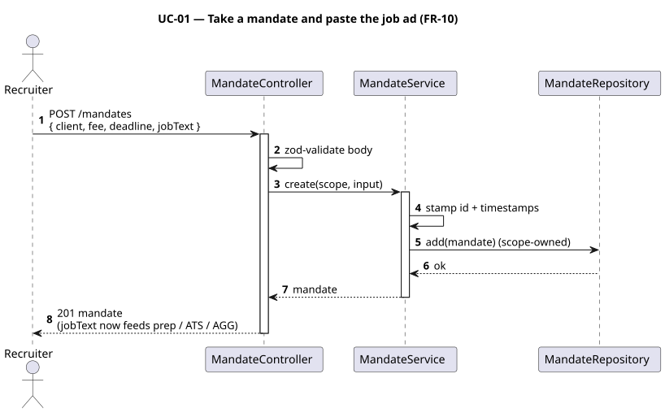

## UC-02 — Build the talent pool

- **Actor:** Recruiter · **Requirements:** FR-11, FR-22, FR-20
- **Trigger:** a new candidate enters the desk.
- **Flow:** add a talent; optionally paste their CV (text or PDF) — the system parses
  it into a structured resume, which the recruiter can edit. Attachments (certificates
  etc.) are uploaded and stored owner-scoped.

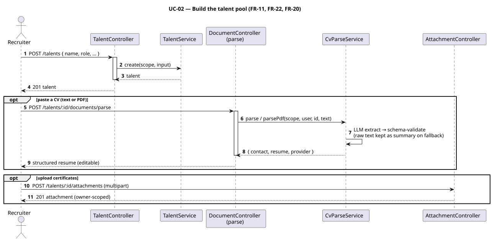

## UC-03 — Find matches for a mandate

- **Actor:** Recruiter · **Requirements:** FR-32, FR-34 · **Decisions:** ADR-0007 (semantics)
- **Trigger:** the recruiter opens a mandate and asks "who fits?".
- **Flow:** the pool is ranked against the mandate by skill fit (skills canonicalised
  first, matched semantically incl. ontology + fuzzy). The recruiter reviews scores and
  adds promising talents to the pipeline as candidacies.

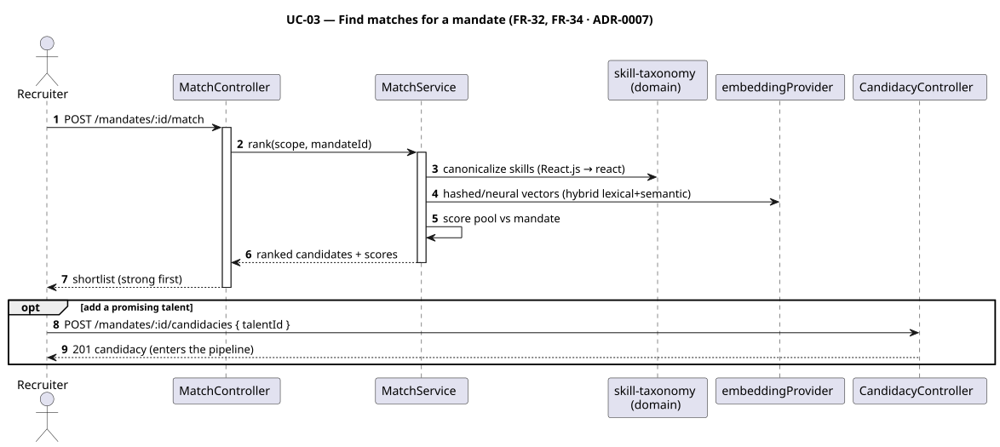

## UC-04 — Understand _why_ a candidate fits

- **Actor:** Recruiter · **Requirements:** FR-33, FR-30
- **Trigger:** the recruiter wants to justify a shortlist to the client.
- **Flow:** request an explanation; the system produces a grounded "Warum passt?"
  summary from CV + job evidence (deterministic fallback when no LLM key).

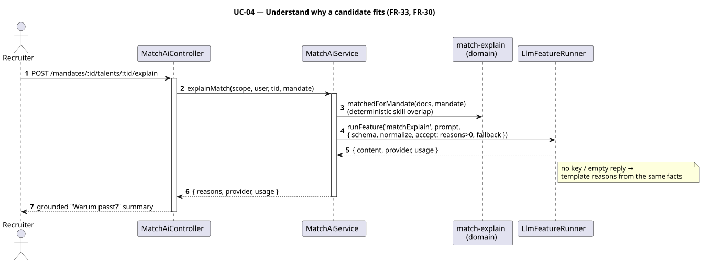

## UC-05 — Prepare the candidate for the interview

- **Actor:** Recruiter · **Requirements:** FR-36, FR-39
- **Trigger:** an interview is scheduled.
- **Flow:** generate a prep kit — skill gaps vs the ad, likely employer Auflagen, tuned
  questions and STAR prompts. Company knowledge is drawn from **first-party interview
  observations** where they exist, otherwise from the curated company archetype.

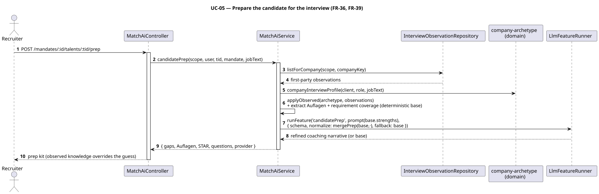

## UC-06 — Draft a client pitch and outreach message

- **Actor:** Recruiter · **Requirements:** FR-37, FR-38, FR-30
- **Trigger:** the recruiter presents the candidate, or makes first contact.
- **Flow:** generate a pitch ("why this candidate") or an outreach message
  (candidate/client, email/LinkedIn). The **grounding self-check** flags any claim
  (inflated years, fabricated skill) not supported by the CV + mandate, so the recruiter
  corrects it before it leaves the building.

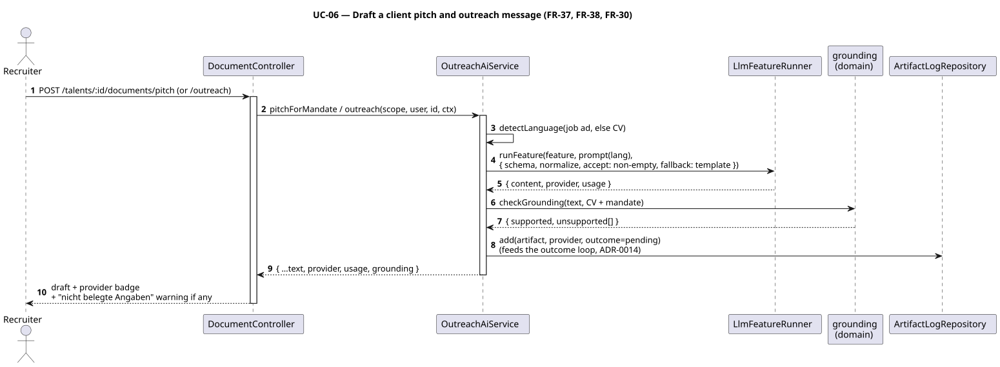

## UC-07 — Run the interview kit

- **Actor:** Recruiter · **Requirements:** FR-35
- **Trigger:** preparing to interview.
- **Flow:** generate structured questions and a scorecard for a consistent, comparable
  interview.

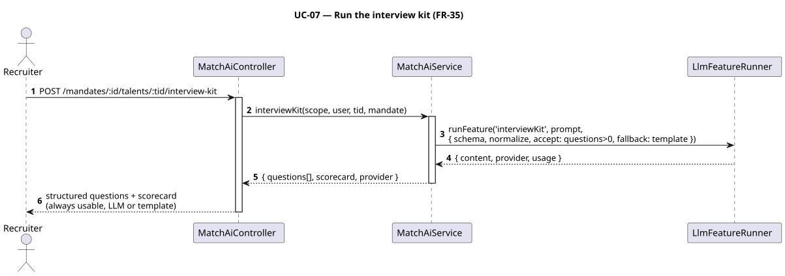

## UC-08 — Capture what actually happened (the flywheel)

- **Actor:** Recruiter · **Requirements:** FR-39
- **Trigger:** an interview concludes.
- **Flow:** record the real interview experience against the mandate's company. This
  first-party observation feeds future prep (UC-05), so company confidence grows with
  use — the legal, first-party data moat.

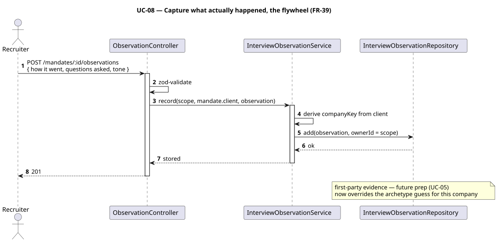

## UC-09 — Move the pipeline and book the fee

- **Actor:** Recruiter · **Requirements:** FR-12, FR-13, FR-14
- **Trigger:** the candidacy progresses.
- **Flow:** advance the candidacy through stages on the board. Reaching `placed`
  auto-creates a placement with its fee; mandate submitted/interview counts and the
  revenue forecast update from the live pipeline.

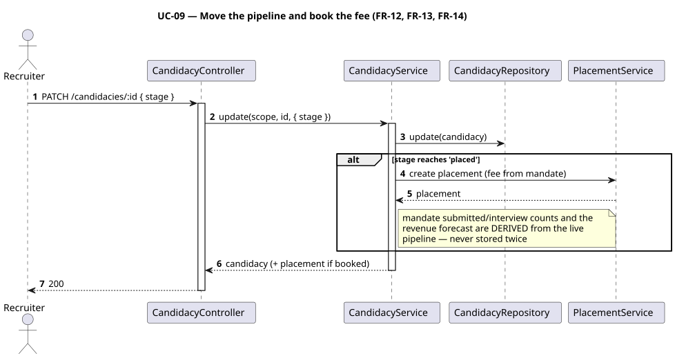

## UC-10 — Search external job boards

- **Actor:** Recruiter/Applicant · **Requirements:** FR-50, FR-51
- **Trigger:** sourcing roles or opportunities.
- **Flow:** run a skill-matched two-tier search across boards; strong fits first,
  stretch roles kept below. Named searches can be saved and re-run.

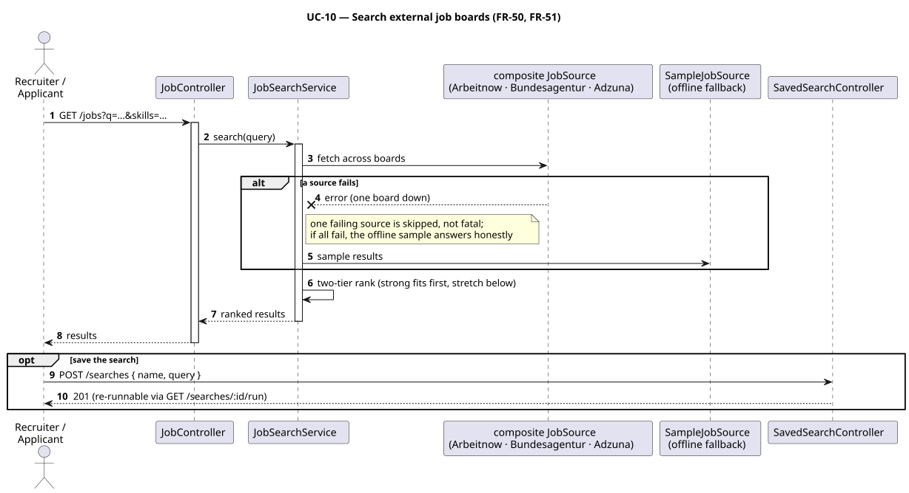

## UC-11 — Check a job ad for AGG compliance

- **Actor:** Recruiter · **Requirements:** FR-41
- **Trigger:** before publishing an ad.
- **Flow:** run the AGG check; potentially discriminatory phrasing is flagged.

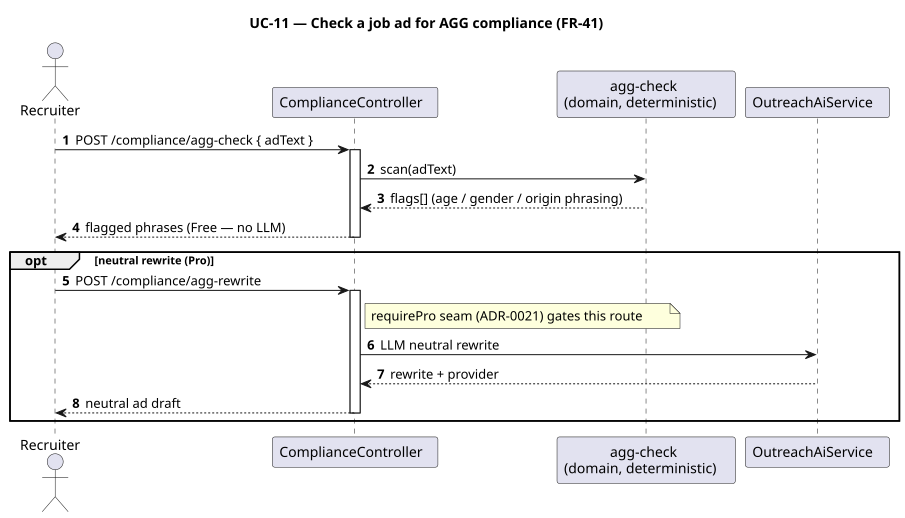

## UC-12 — Meet DSGVO obligations

- **Actor:** Applicant (self-service) / Admin (pool) · **Requirements:** FR-60, FR-61
- **Trigger:** a data-subject request, or routine retention housekeeping.
- **Flow:** a user exports or erases their own account; an admin runs the retention
  report and anonymises talent records past their horizon.

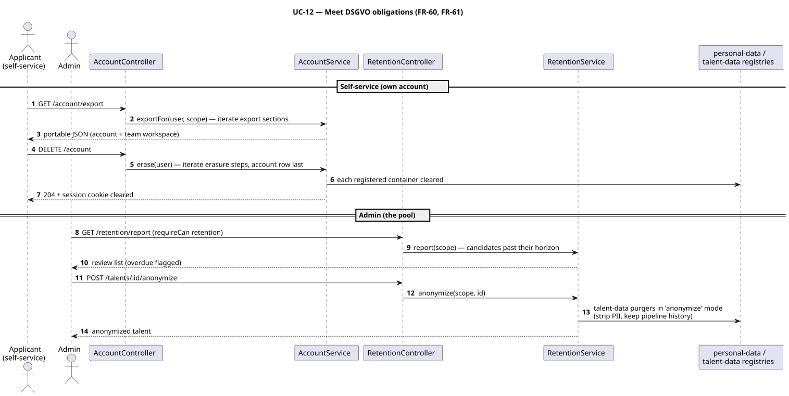

## UC-13 — Manage the team

- **Actor:** Admin · **Requirements:** FR-04, FR-03
- **Trigger:** onboarding/offboarding a colleague.
- **Flow:** list members and adjust roles. All members then share the team's recruiting
  data (team scope).

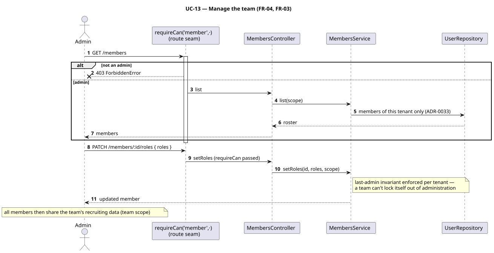

## UC-14 — Bring your own AI key and watch the cost

- **Actor:** Recruiter/Admin · **Requirements:** FR-31, FR-30
- **Trigger:** enabling richer AI output.
- **Flow:** store a per-user Claude/Gemini key (encrypted); switch provider at runtime.
  Every AI call is metered so requests/tokens/cost are visible per user and feature.

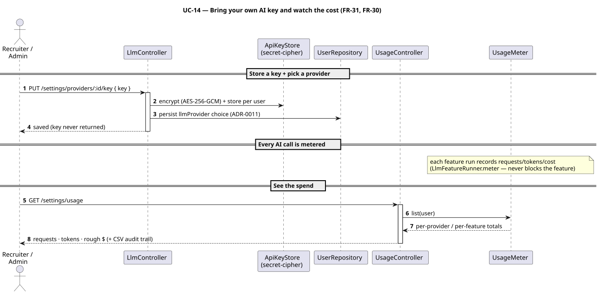

## UC-15 — Apply in the job's language

- **Actor:** Recruiter · **Requirements:** FR-42, FR-23, FR-43
- **Trigger:** the job ad and the candidate's documents are in different languages
  (e.g. a German CV, an English posting).
- **Flow:** generated pitch/outreach/cover letters automatically follow the language of
  the job ad (detected from the mandate's Stellenanzeige — independent of the app UI).
  If the documents themselves only exist in one language, the recruiter clicks
  **Translate → EN/DE** in the editor to create the other-language variant (stored
  alongside the original, reviewed before sending; requires an AI key). Every draft
  shows whether AI or the deterministic template produced it.

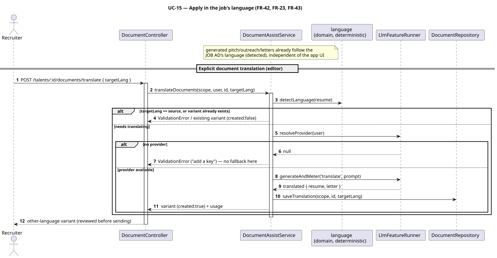
